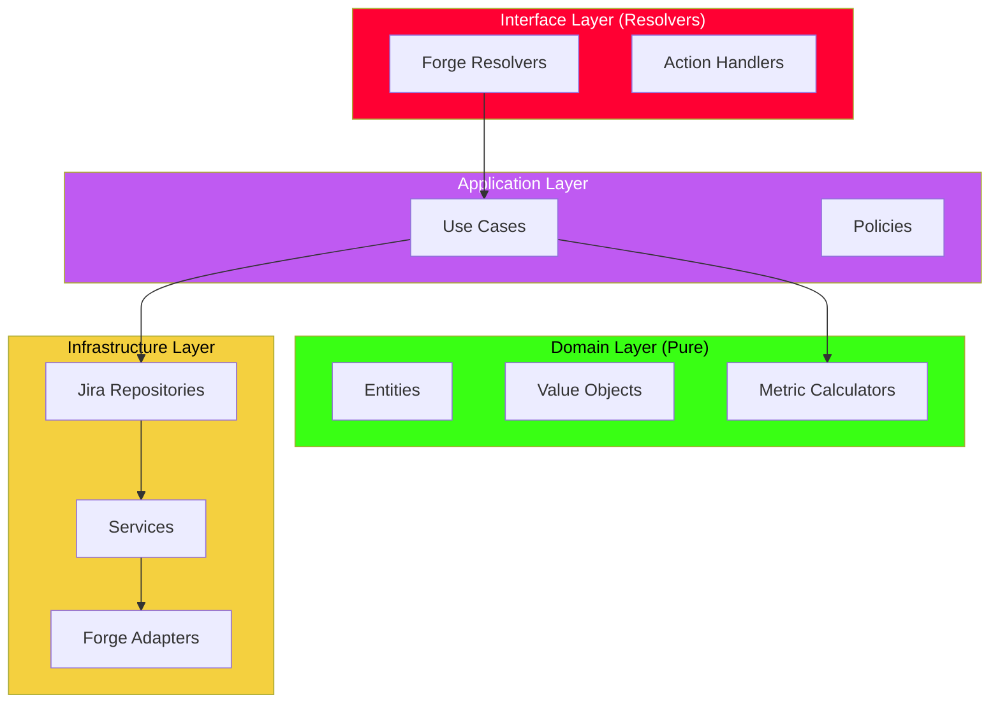
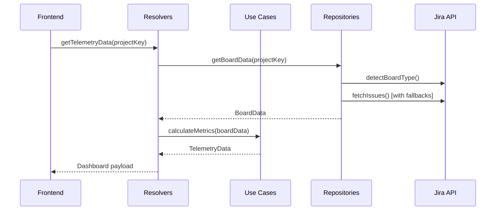
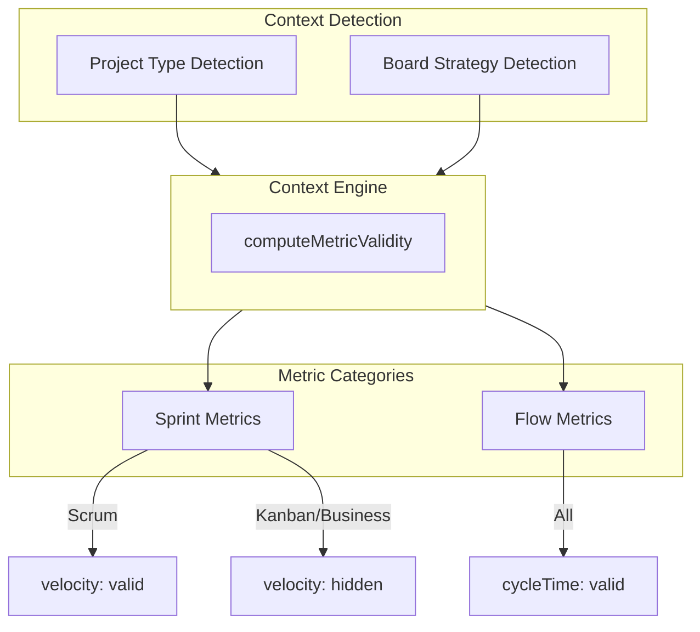

# Pit Wall Strategist — Architecture Reference

## Overview

Pit Wall Strategist is an Atlassian Forge app implementing **Clean Architecture** with a React/Vite UI. It monitors Jira sprint/flow telemetry, flags stalled work, and proposes F1-themed strategic actions via a Rovo AI agent. Supports Scrum, Kanban, and Jira Work Management (Business) projects.

## Clean Architecture Layers



### Layer Dependencies (Strict Rules)

| Layer | Can Import From | Cannot Import From |
|-------|-----------------|-------------------|
| **Domain** | Nothing external | Forge, Jira SDK, Infrastructure |
| **Application** | Domain | Forge directly |
| **Infrastructure** | Domain, Forge API | Application |
| **Interface** | Application, Infrastructure | — |

---

## Domain Layer (`src/domain/`)

Pure business logic with **no Forge or Jira SDK imports**.

### Entities & Value Objects

| Module | Purpose |
|--------|---------|
| `issue/DomainIssue.ts` | Domain representation of a Jira issue |
| `issue/JiraStatusCategory.ts` | Value object: `TO_DO`, `IN_PROGRESS`, `DONE` |
| `flow/FlowCategory.ts` | SAFe flow types: features, defects, risks, debt |
| `board/BoardContext.ts` | Board type enumeration and context |

### Metric Calculators

| Calculator | Responsibility |
|------------|----------------|
| `metrics/CycleTimeCalculator.ts` | Changelog-based cycle time with resolution fallback |
| `metrics/VelocityCalculator.ts` | Sprint velocity with per-assignee breakdown |
| `metrics/ThroughputCalculator.ts` | Flow throughput for Kanban |
| `metrics/WipAnalysis.ts` | Work-in-progress analysis |
| `metrics/SprintHealthMetric.ts` | Sprint health scoring |

---

## Application Layer (`src/application/`)

Use cases and orchestration logic.

| Module | Purpose |
|--------|---------|
| `usecases/GetFlowMetricsUseCase.ts` | Orchestrates flow metrics collection |
| `diagnostics/DiagnosticsUseCase.ts` | Health check orchestration |
| `rovo/RovoChatExpertSystem.ts` | AI chat intent detection and response |

---

## Infrastructure Layer (`src/infrastructure/`)

External system adapters using Forge API.

### Jira Repositories

| Repository | Responsibility |
|------------|----------------|
| `jira/JiraBoardRepository.ts` | Board data with multi-level fallbacks |
| `jira/JiraDataService.ts` | Low-level Jira API calls |

### Services

| Service | Responsibility |
|---------|----------------|
| `services/IssueSearchService.ts` | Token-paginated JQL search with retry |
| `services/BoardDiscoveryService.ts` | Project type & board type detection |
| `services/StatusMapService.ts` | Per-project status category resolution |
| `services/FieldDiscoveryService.ts` | Custom field discovery (Story Points, Sprint) |
| `services/SecurityGuard.ts` | Permission validation |
| `services/LegacyTelemetryAdapter.ts` | Adapter bridging old patterns to new architecture |

### Authentication Policy

- **Read operations**: `asApp()` first, fallback to `asUser()` on 401/403
- **Write operations**: Always `asUser()` to ensure user authorization

---

## Interface Layer (`src/resolvers/`)

Forge resolver handlers organized by domain.

### Resolver Modules

| Module | Resolvers |
|--------|-----------|
| `config/ConfigResolvers.ts` | View mode, theme, board selection |
| `telemetry/TelemetryResolvers.ts` | Dashboard telemetry data |
| `diagnostics/DiagnosticsResolvers.ts` | Health checks, permissions |
| `timing/TimingResolvers.ts` | Lead time, cycle time metrics |
| `trends/TrendResolvers.ts` | WIP and velocity trends |
| `analytics/AnalyticsResolvers.ts` | Advanced analytics, flow metrics |
| `rovo/RovoResolvers.ts` | AI chat, analysis |
| `actions/ActionResolvers.ts` | 10 Rovo strategic actions |

### Rovo Actions (10 Strategies)

| Action Key | F1 Name | Jira Operation |
|------------|---------|----------------|
| `split-ticket` | The Undercut | Create subtasks |
| `reassign-ticket` | Team Orders | Update assignee |
| `defer-ticket` | Retire Car | Move to backlog |
| `change-priority` | Blue Flag | Update priority |
| `transition-issue` | Push to Limit | Transition status |
| `add-blocker-flag` | Red Flag | Add blocked label/flag |
| `link-issues` | Slipstream | Create issue link |
| `update-estimate` | Fuel Adjustment | Update story points |
| `add-radio-message` | Radio Message | Add comment |
| `create-subtask` | Pit Crew Task | Create subtask |

---

## Platform Modes

| Mode | Backend (`PLATFORM`) | Frontend (`VITE_PLATFORM`) |
|------|----------------------|---------------------------|
| **Atlassian** | Real Jira API calls | `@forge/bridge` |
| **Local** | Mock data | Local shim |

---

## Data Flow



### Fallback Chain (Scrum)

1. Active sprint issues
2. Future sprint issues  
3. `openSprints()` JQL
4. Board filter JQL
5. Project JQL (last resort)

---

## Metric Validity System

The app uses a **context-aware metric validity system** to show/hide metrics based on project type and board strategy.



### Metric Validity Rules

| Context | Sprint Metrics | Flow Metrics |
|---------|---------------|--------------|
| **Scrum (Software)** | ✅ All visible | ✅ All visible |
| **Kanban (Software)** | ❌ Hidden | ✅ All visible |
| **Business (JWM)** | ❌ Hidden | ✅ All visible |

### 10 Tracked Metrics

| Category | Metric | Description |
|----------|--------|-------------|
| Sprint | `velocity` | Story points per sprint |
| Sprint | `sprintHealth` | Sprint progress vs expected |
| Sprint | `sprintProgress` | Completion percentage |
| Sprint | `scopeCreep` | Scope changes mid-sprint |
| Flow | `wip` | Work in progress count |
| Flow | `wipConsistency` | WIP stability over time |
| Flow | `cycleTime` | Time from start to done |
| Flow | `leadTime` | Time from creation to done |
| Flow | `throughput` | Items completed per period |
| Flow | `flowEfficiency` | Active WIP / Total WIP |

---

## Error Handling & Resilience

- **JQL POST preferred** over deprecated GET endpoints
- **Token-based pagination** for large result sets
- **Retry with exponential backoff** on transient failures
- **Permission validation** before data access
- **Graceful degradation** when Agile features unavailable

---

## Testing Architecture

| Type | Location | Framework |
|------|----------|-----------|
| Unit | `tests/unit/` | Vitest |
| Integration | `tests/integration/` | Vitest |
| E2E | `tests/e2e/` | Playwright |

**Coverage areas**: Telemetry, fallbacks, flow heuristics, status mapping, field discovery, timing metrics.

---

## Manifest Configuration

- **Module**: `jira:projectPage` for dashboard UI
- **Module**: `rovo:agent` for AI agent with 10 actions
- **Scopes**: `read:issue`, `write:issue`, `read:sprint`, `read:board-scope`, `storage:app`
- **CSP**: Inline styles permitted

---

## Known Limitations

1. **Multiple boards**: Selects first board with active sprint
2. **Cycle time sampling**: Uses changelog when available, falls back to resolution date
3. **Subtask creation**: Dynamically discovers subtask issue type name

---

## File Structure

```
src/
├── domain/           # Pure business logic (NO Forge imports)
│   ├── board/        # Board context types
│   ├── flow/         # SAFe flow categories
│   ├── issue/        # DomainIssue, JiraStatusCategory
│   ├── metrics/      # Calculators (CycleTime, Velocity, Throughput)
│   └── ...
├── application/      # Use cases and orchestration
│   └── usecases/     # GetFlowMetricsUseCase
├── infrastructure/   # External adapters
│   ├── jira/         # JiraBoardRepository, JiraDataService
│   ├── services/     # StatusMapService, FieldDiscoveryService
│   └── forge/        # Forge-specific adapters
└── resolvers/        # Interface layer (Forge resolver handlers)
    ├── config/
    ├── telemetry/
    ├── diagnostics/
    ├── timing/
    ├── trends/
    ├── analytics/
    ├── rovo/
    └── actions/
```