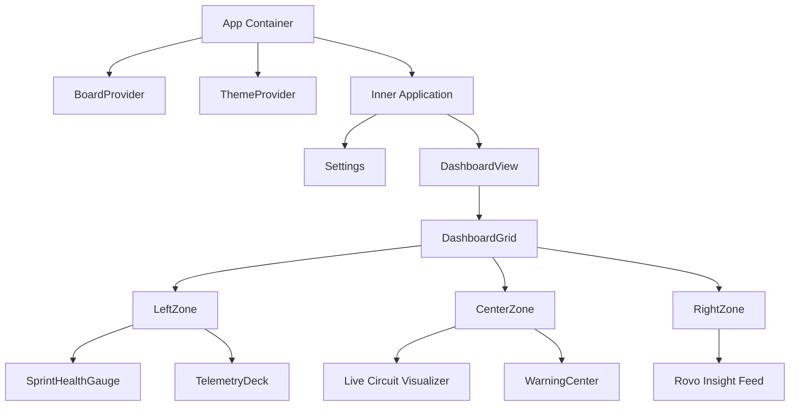

# Frontend Architecture Reference

## Overview

The Pit Wall Strategist frontend is a sophisticated React application built with TypeScript and Vite. It adheres to **Clean Architecture** principles, separating concerns between Data/State logic (hooks) and Visual Presentation (components). It strictly follows Atlassian Forge constraints (CSP, native look & feel).

## Architectural Patterns

### 1. Data Separation (Hook Pattern)

We strictly separate data fetching and state management from rendering components.

-   **`hooks/useDashboardData.ts`**: The "Brain" of the frontend. It centralizes all data fetching, coordinates parallel API requests, manages `loading`/`error` states, and handles context updates.
-   **`services/api.ts`**: A typed service layer that abstracts the Forge Bridge `invoke` calls. This makes the code testable and decoupled from the specific transport mechanism.

### 2. Layout Strategy (Holy Grail Grid)

The dashboard uses a responsive "Holy Grail" layout implemented in `DashboardGrid.tsx`:

-   **Desktop (>1200px)**: 3 Columns. Left (Metrics) | Center (Visuals) | Right (Strategy).
-   **Tablet (>768px)**: 2 Columns / Grid Areas (Metrics | Visuals).
-   **Mobile**: Single Column Stack.

### 3. Component Hierarchy

### 4. UI/UX Principles

-   **One Primary Insight**: Panels answer exactly one question.
-   **Progressive Disclosure**: Detailed info is hidden behind Tooltips or Modals. Panels are collapsible.
-   **Semantic Theming**: All colors use CSS Variables (`--color-success`, `--bg-surface`) defined in `theme/variables.css`. No hex codes in components.
-   **Native Feel**: Glassmorphism and typography align with Atlassian Design System aesthetics but with an F1 twist.

## Rovo Integration

Rovo is integrated as a strategic partner, not just a chatbot.

### Context Awareness
The app injects context into Rovo interactions via `utils/rovoBridge.ts`.
When a user clicks "Ask Rovo", the app serializes the current state (Board Type, Health Metrics, Selected Issue) into a hidden system prompt.

### UI Bridge
-   **Triggers**: Specific intent buttons (e.g. "Analyze Pace" in SprintHealthGauge).
-   **Response**: Rovo opens in the side panel, maintaining the user's context.

## Testing Strategy

-   **Unit Tests**: Focused on `useDashboardData` and utility hooks.
-   **Visual Verification**: Manual checks for Dark/Light mode and Tablet/Mobile responsiveness.

## Files of Interest

-   **`src/App.tsx`**: Main entry point, layout conductor.
-   **`src/hooks/useDashboardData.ts`**: Data orchestration.
-   **`src/services/api.ts`**: Backend communication.
-   **`src/components/NextGen/Layout/DashboardGrid.tsx`**: Responsive grid logic.
-   **`src/components/Dashboard/SprintHealthGauge.tsx`**: Example of "Smart Component" with Rovo hooks.
